# Strategic Hub — Sistem de Analiză a Performanței și Riscului Resurselor Umane

Dashboard Power BI de analiză predictivă a riscului de burnout / plecare a angajaților, cu Machine Learning integrat (Python) direct în raport: regresie liniară, K-Means clustering, simulări what-if.

Proiect de licență — toate datele folosite sunt **sintetice** (generate cu seed fix, fără date reale sau informații personale).

## Ce face proiectul

- Monitorizează performanța a 200 de angajați simulați, pe 12 luni (2023)
- Clasifică riscul de plecare (Stabil / Potential / Risc Ridicat) pe baza unor reguli de business
- Prezice probabilitatea de risc cu un model **Random Forest** antrenat direct în Power Query (Python)
- Segmentează angajații cu **K-Means Clustering** (Low / Core / Top performers)
- Identifică factorii determinanți ai performanței cu **regresie liniară**
- Simulează impactul orelor de training asupra scorului de performanță și riscului (what-if analysis)
- 15 pagini de raport, de la hub-ul de navigare până la un rezumat executiv cu priorități și recomandări

## Tehnologii

- **Power BI Desktop** (format PBIP — Power BI Project, text-based)
- **DAX** pentru măsuri (Scor_Estimat, Procent_Risc, Prag_Burnout etc.)
- **Python** (pandas, scikit-learn) — integrat ca vizualizări native și în Power Query pentru scoring ML
- **Power Query (M)** pentru ETL

## Structura repo-ului

```
licenta_sonia.Report/          # definiția raportului (pagini, vizuale) — format PBIP
licenta_sonia.SemanticModel/   # modelul semantic (tabele, măsuri DAX, relații) — format TMDL
licentavs.pbix                 # fișierul Power BI complet, gata de deschis în Power BI Desktop
data/
  generator_date.py            # scriptul care generează datele sintetice
  date_angajati_istoric.csv    # setul de date (2400 înregistrări: 200 angajați x 12 luni)
docs/                          # lucrarea de licență și prezentarea
DOCUMENTATIE_LICENTA.md        # documentația tehnică detaliată a proiectului
screenshots/                   # capturi ale celor 15 pagini ale raportului
```

## Paginile raportului

### 1. Meniu principal

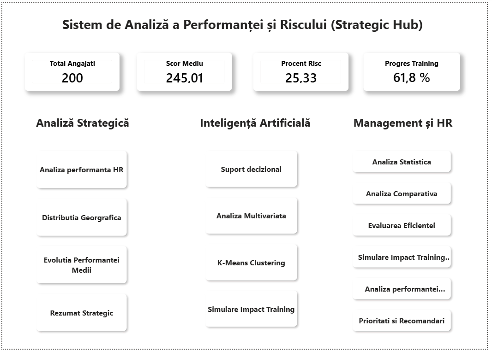

Hub central de navigare, cu KPI generali (Total Angajați, Scor Mediu, Procent Risc, Progres Training) și trei categorii de acces rapid: Analiză Strategică, Inteligență Artificială, Management și HR.

### 2. Analiza performanței HR

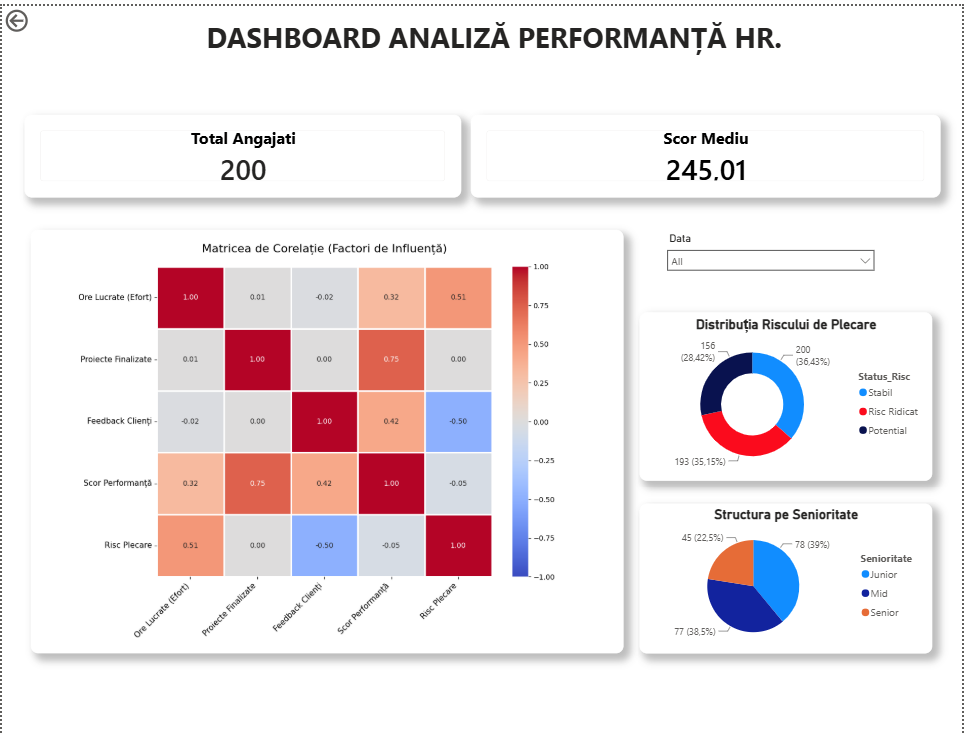

Dashboard principal cu filtrare pe dată, distribuția statusului de risc (donut chart), o analiză Python a factorilor de performanță și distribuția angajaților pe nivel de seniorat.

### 3. Suport decizional

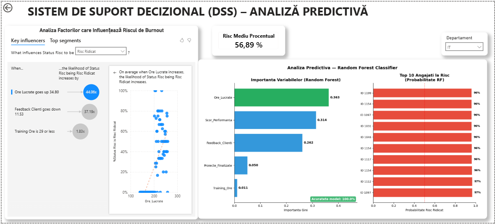

Sistem de suport decizional (DSS): factorii cheie care influențează riscul (Key Influencers) și probabilitatea de risc calculată per angajat cu un model Random Forest, filtrabil pe departament.

### 4. Distribuția geografică

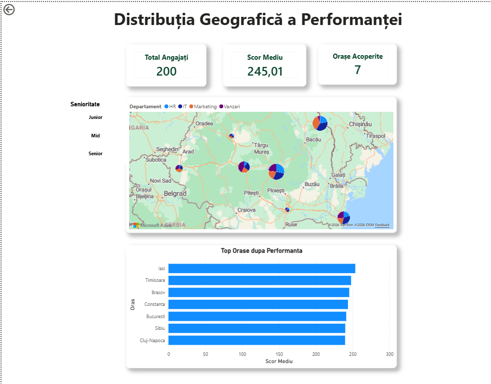

Hartă interactivă (Azure Map) cu performanța pe oraș, alături de un grafic comparativ al scorurilor pe orașe.

### 5. Evoluția performanței medii

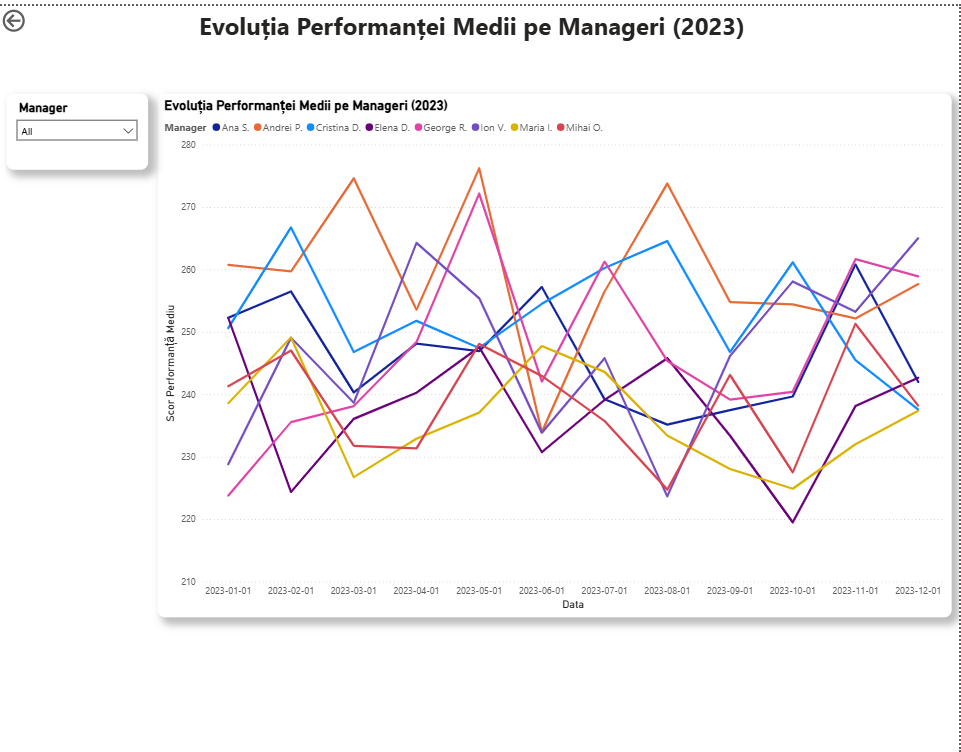

Evoluția lunară a scorului mediu de performanță pentru fiecare manager, de-a lungul anului 2023.

### 6. Analiza multivariată

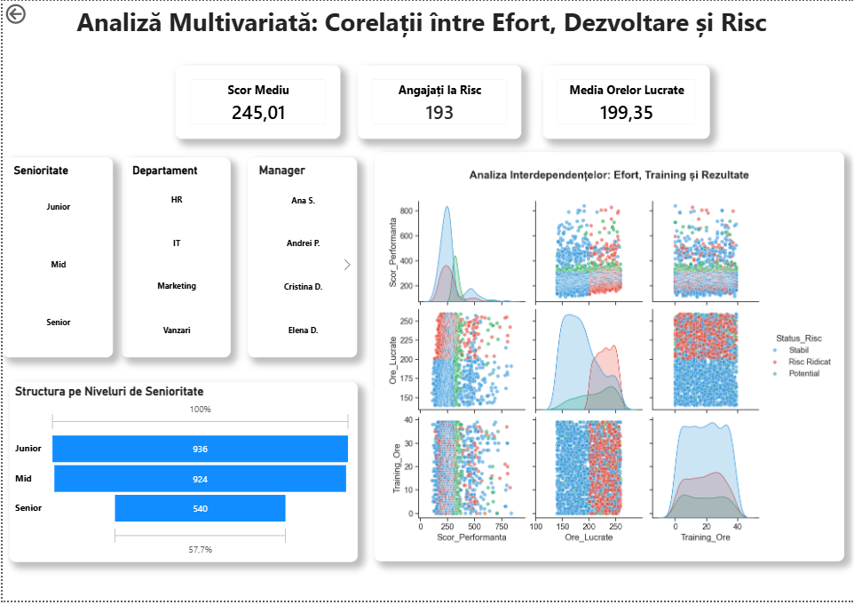

Corelații între efort (ore lucrate), dezvoltare (training) și risc, cu un funnel pe niveluri de seniorat și o analiză Python multivariată.

### 7. Analiza statistică

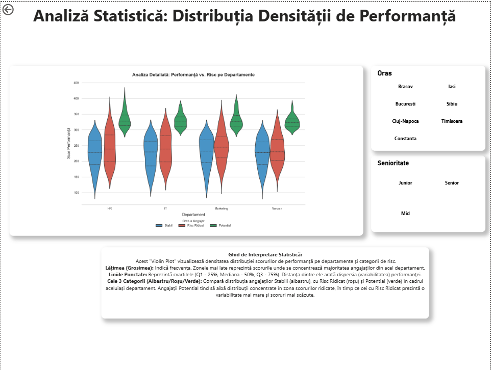

Violin plot generat în Python, care arată densitatea distribuției scorurilor de performanță pe departamente și categorii de risc, cu ghid de interpretare inclus în pagină.

### 8. Analiza comparativă

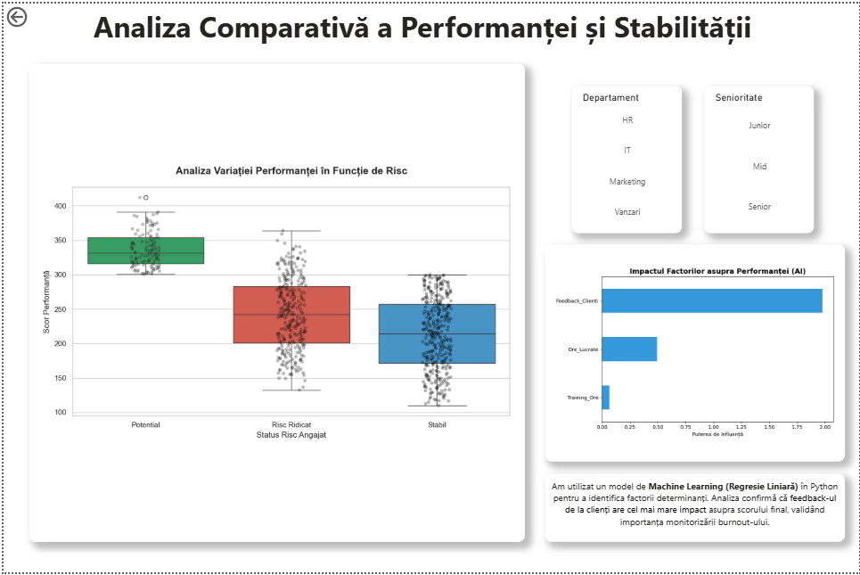

Model de regresie liniară (Python) care identifică orele lucrate drept factorul cu cel mai mare impact asupra scorului final, confirmând legătura cu riscul de burnout.

### 9. Evaluarea eficienței

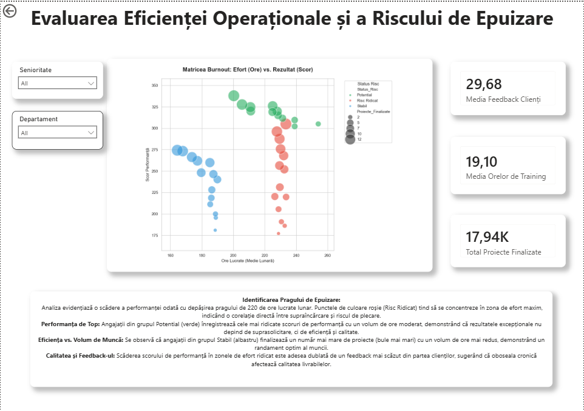

Analiza pragului de burnout (220h lucrate/lună), cu un vizual Python care arată relația dintre volumul de muncă, performanță și numărul de proiecte finalizate.

### 10. K-Means Clustering

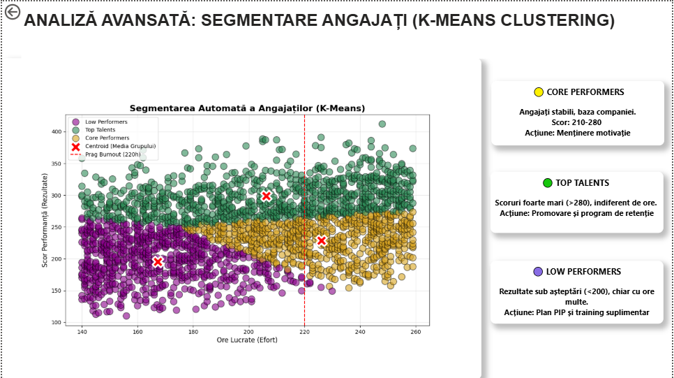

Segmentare a angajaților în 3 clustere — Low Performers, Core Performers, Top Talents — fiecare cu recomandarea specifică de acțiune pentru HR.

### 11. Simulare impact training asupra riscului

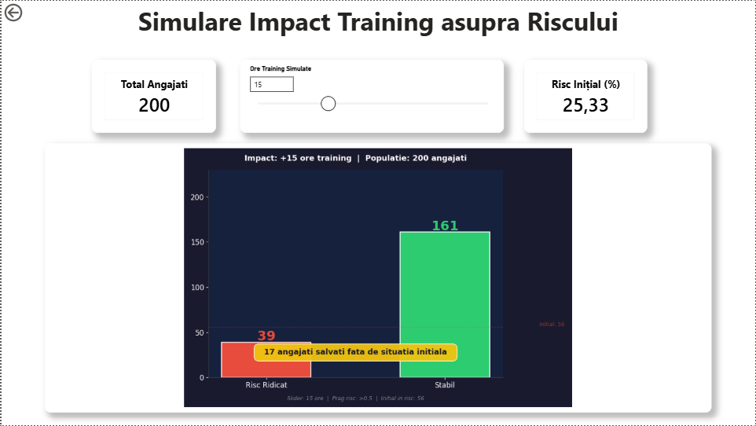

Simulare what-if interactivă: ajustezi nivelul simulat de training și vezi impactul direct asupra procentului de risc.

### 12. Simulare impact training

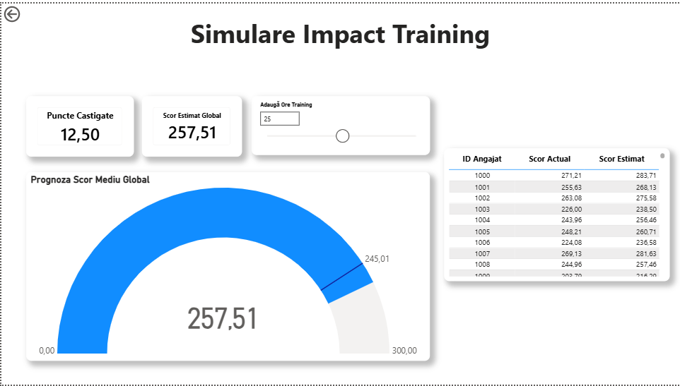

Comparație directă (gauge) între scorul actual de performanță și scorul estimat după training suplimentar, plus punctele câștigate estimate.

### 13. Analiza performanței individuale

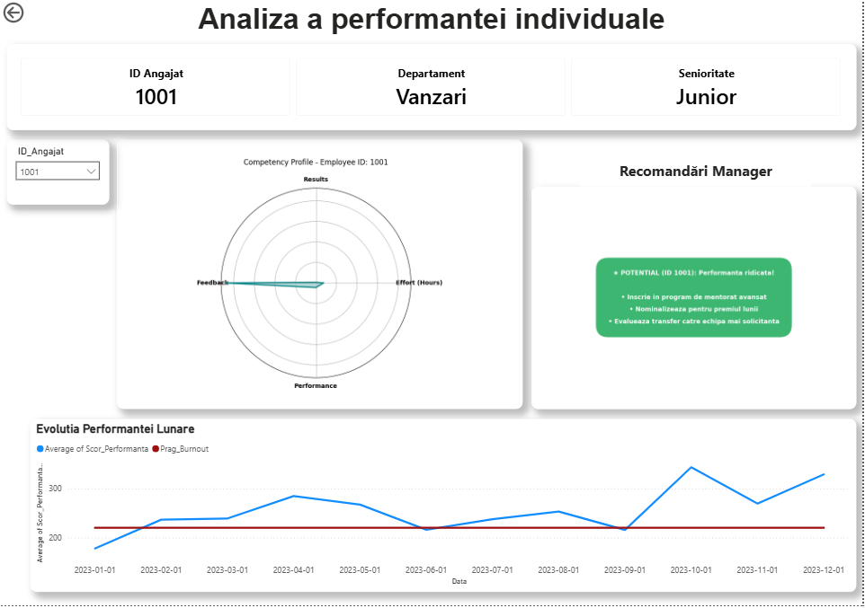

Vizualizare la nivel de angajat individual: evoluția scorului față de pragul de burnout și recomandări generate pentru manageri.
